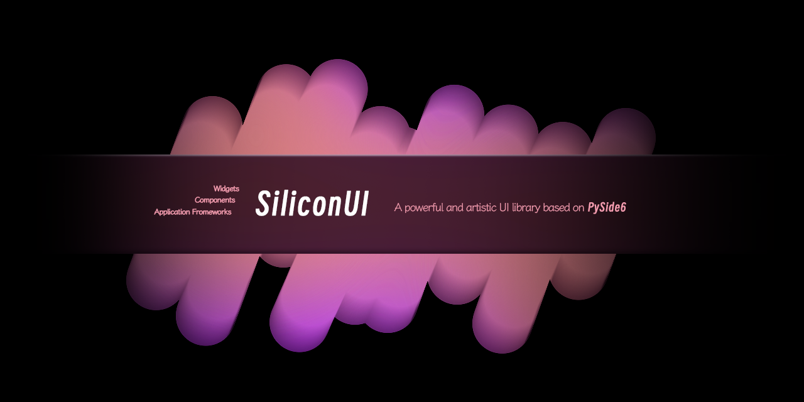

<p align="center">  
  
  <a href="#">
    
  </a>
  
  <h2 align="center">PySide6-SiliconUI</h2>
  <p align="center">A powerful and artistic UI library based on PySide6</p>

<p align="center">
    English | <a href="docs/README_zh.md">简体中文</a>
</p>

## Install
I'm using [pdm](https://github.com/pdm-project/pdm) as Python package and dependency manager.

```powershell
pdm install
```
Due to the fact that this project is still in the development stage, it is temporarily not available on PyPi.

However, we are currently working hard on it and will be available soon.


## Run Examples
To quick start, run:
```powershell
.\.venv\Scripts\activate.ps1
python ".\examples\Gallery for siui\start.py"
```
Other more detailed examples for widgets are coming soon.


## License
PySide6-SiliconUI is licensed under [GPLv3](LICENSE) 

Copyright © 2024 by H1DDENADM1N.